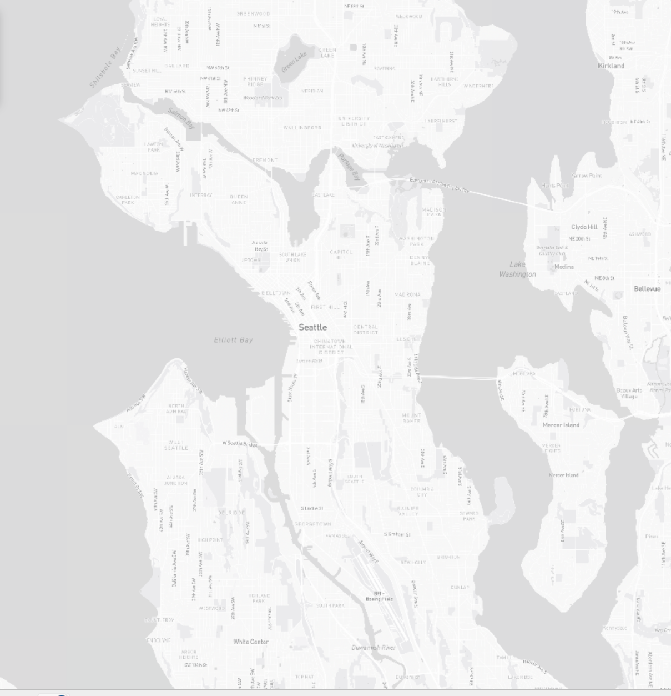
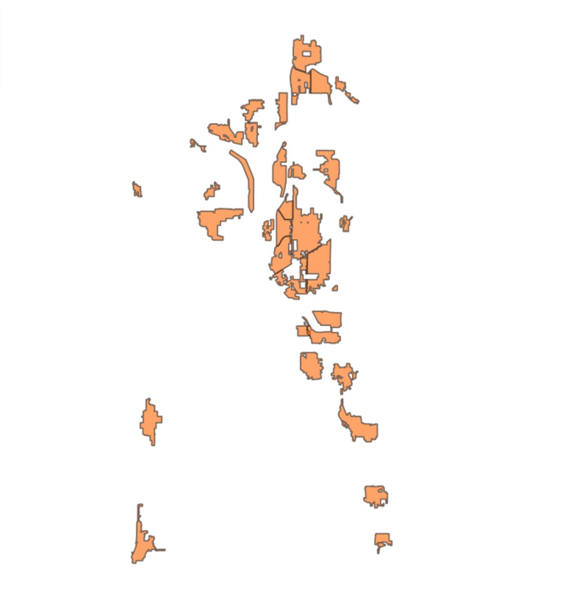
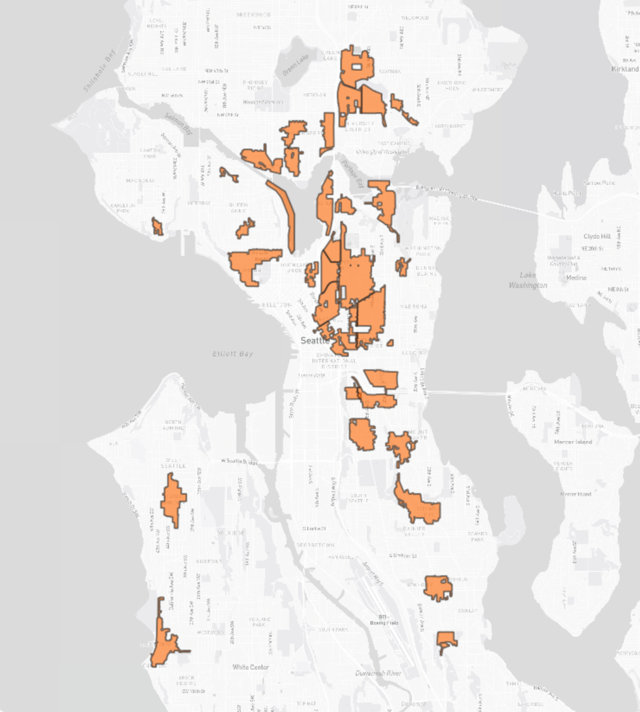
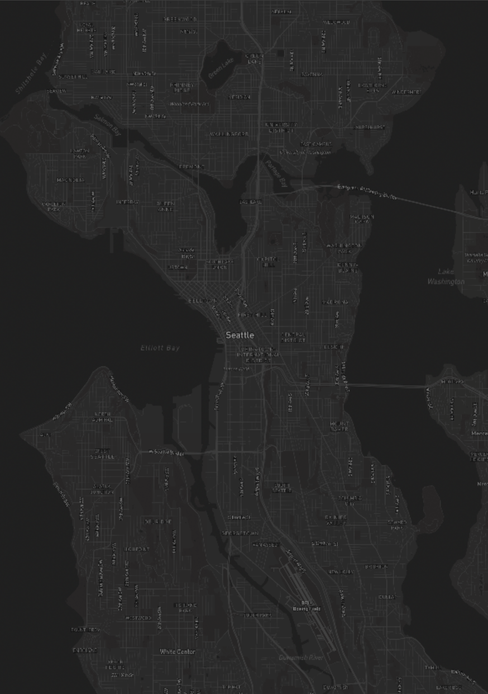

# **GEOG 458 - Lab 4 | Seattle Restricted Parking Zones Web Map**

## Live Map

[View the Web Map](https://naamaal12.github.io/Seattle-Parking-Zones/)

## Project Overview

This web map visualizes Seattle's Restricted Parking Zone (RPZ) areas through four different tile set layers. The RPZ program manages on-street parking in residential neighborhoods located near major traffic generators such as universities, hospitals, and business districts.

## Geographic Area

The map covers the Seattle metropolitan area, focusing on neighborhoods with designated restricted parking zones. The extent includes areas from West Seattle in the south to Northgate in the north, and from Puget Sound in the west to Lake Washington in the east.

## Map Layers

### Tileset 1: Monochrome Basemap
A clean, light-colored basemap designed to provide geographic context without visual distraction. Created using Mapbox Light style with customized colors and labels. This layer serves as the foundation for understanding Seattle's geography.

- Zoom Levels: 11 - 15

### Tileset 2: Restricted Parking Zones Only
A thematic layer displaying only the RPZ boundaries as orange polygons. This layer isolates the parking zone data without any basemap, allowing users to focus solely on the spatial distribution of restricted parking areas.

- Zoom Levels: 11 - 15
- Data Source: Seattle GeoData Open Data Portal

### Tileset 3: Combined (Basemap + Parking Zones)
A combined visualization layering the RPZ thematic data over the monochrome basemap. This provides the most complete view, showing parking zones in their geographic context with neighborhood labels and street networks visible.

- Zoom Levels: 11 - 15

### Tileset 4: Dark Theme
A custom-styled dark theme map featuring the parking zone data. This layer uses a dark color palette demonstrating how map themes can be customized for different audiences or purposes.

- Zoom Levels: 11 - 15

## Screenshots

### Monochrome Basemap

### Parking Zones Only

### Combined View

### Dark Theme

## Map Features

- Full-screen display
- Interactive layer switcher
- Zoom controls
- Scale bar
- Navigation controls

## Data Sources

- Basemap: Mapbox
- Restricted Parking Zone Areas: Seattle GeoData Open Data Portal

## Technologies Used

- Mapbox GL JS
- QGIS (tile generation)
- HTML

## Author

Naama Al-Musawi | University of Washington | GEOG 458 Winter 2026
